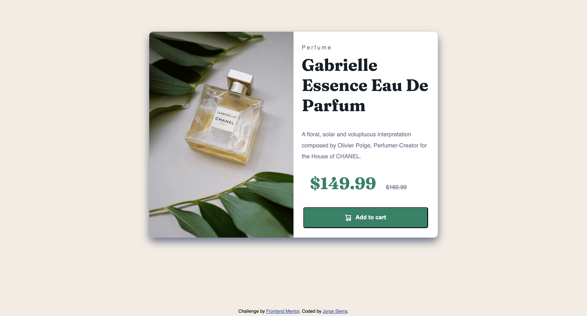

# Frontend Mentor - API REST de países con solución de cambio de tema de color

## Tabla de contenidos

- [Resumen](#resumen)
  - [El reto](#el-reto)
  - [Capturas de pantalla](#capturas-de-pantalla)
  - [Enlaces](#enlaces)
- [Mi proceso](#mi-proceso)
  - [Construido con](#construido-con)
  - [Lo que aprendí](#lo-que-aprendí)
  - [Desarrollo continuo](#desarrollo-continuo)
  - [Recursos útiles](#recursos-útiles)
- [Autor](#autor)
- [Agradecimientos](#agradecimientos)

## Resumen

### El reto

Los usuarios deberían poder:

- Ver el diseño óptimo para el sitio dependiendo del tamaño de la pantalla de su dispositivo.
- Ver estados interactivos para los elementos interactivos.
- Agregar productos al carrito (simulación).

## Guía de estilos

La guía completa de estilos y decisiones de diseño se encuentra en [style-guide.md](./style-guide.md).

### Capturas de pantalla



### Enlaces

- URL de solución: [URL GITHUB](https://github.com/jorge-maikel-sierra/countries-explorer-webapp)
- URL del sitio en directo: [URL PRODUCCION](https://jorge-maikel-sierra.github.io/countries-explorer-webapp)

## Mi proceso

### Construido con

- HTML5 semántico
- Propiedades personalizadas de CSS
- Flexbox
- Diseño adaptable (responsive design)
- Flujo de trabajo mobile-first

### Lo que aprendí

Durante este proyecto, reforcé mis conocimientos en HTML y CSS. Algunos puntos clave incluyen:

- **Diseño adaptable**: Aprendí a usar media queries para ajustar el diseño según el tamaño de la pantalla.

```css
@media (max-width: 768px) {
  .product-card {
    flex-direction: column;
    width: 375px;
    height: 800px;
  }
}
```

- **Uso de variables CSS**: Implementé variables para mantener consistencia en los colores y tipografía.

```css
:root {
  --green-500: hsl(158, 36%, 37%);
  --green-700: hsl(158, 42%, 18%);
  --black: hsl(212, 21%, 14%);
  --grey: hsl(228, 12%, 48%);
  --cream: hsl(30, 38%, 92%);
  --white: hsl(0, 0%, 100%);
}
```

- **Estilización de botones interactivos**: Aprendí a manejar estados como `hover` y `focus` para mejorar la experiencia del usuario.

```css
.add-to-cart:hover {
  background-color: var(--green-700);
}

.add-to-cart:focus {
  outline: 2px solid var(--green-500);
  outline-offset: 2px;
}
```

### Desarrollo continuo

Quiero seguir mejorando mis habilidades en CSS avanzado, especialmente en áreas como animaciones y transiciones, para crear experiencias más dinámicas y atractivas.

### Recursos útiles

- [W3Schools](https://www.w3schools.com/) - Una excelente fuente de recursos y tutoriales que me ayudó a reforzar conceptos de JavaScript y HTML.
- [CSS3 - MDN Web Docs](https://developer.mozilla.org/es/docs/Web/CSS) - Documentación detallada sobre CSS que fue fundamental para implementar los estilos y el tema oscuro.
- [CSS Tricks](https://css-tricks.com/) - Un recurso útil para aprender técnicas avanzadas de CSS.

## Autor

- GitHub - [@jorge-maikel-sierra](https://github.com/jorge-maikel-sierra)
- Frontend Mentor - [@jorge-maikel-sierra](https://www.frontendmentor.io/profile/jorge-maikel-sierra)
- Twitter - [@Jorge_Sierra_1](https://x.com/Jorge_Sierra_1)

## Agradecimientos

Quiero expresar mi más profundo agradecimiento a Nolger Rodriguez por su continuo apoyo y colaboración. Gracias por creer en mí, tanto como desarrollador como persona. Tu confianza y guía han sido fundamentales en mi crecimiento profesional y personal.
